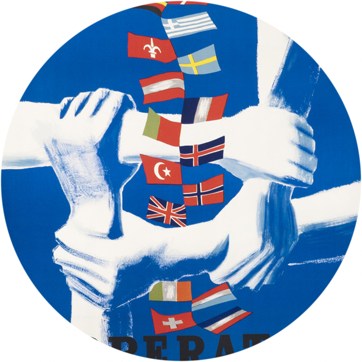

## Solidarity and shared identity in Europe

The long-term viability of European integration relies on a sense that member states and publics share important connections. Whether framed in terms of a European identity, the idea of linked fates, or more prosaically economic interdependence, a feeling that states and publics are connected is essential. Where does such a feeling come from? Does it make sense to think of it as transnational solidarity? Is it stronger in some countries than in others? And how do the European Union’s limits affect who the connectedness extends to?

### Meaning of solidarity

The word "solidarity" itself is widely used in discussions of the European Union member states' responses to the various crises that have challenged the EU since the turn of the century. But does it mean the same thing to people across member states? Differences in the understanding of what "solidarity" is and what it requires from them vis-à-vis other member states may produce disagreement and problems reaching and implementing policy responses. In a working paper with the students in my undergraduate research lab ([STAIR lab](stair.wm.edu)) we aim to provide an answer to this question. Preliminary findings do indicate that there are considerable differences both in the meaning of the word and in the frequency with which it is used in national discussions.

### Measuring solidarity

As differences in the meaning of the world "solidarity" already suggest, measuring the presence of solidarity is non-trivial. In earlier research, I have investigated the degree to which a sense of shared identity exists (and is perhaps getting stronger) across the European Union, as measured in survey responses about whether people feel European. My current work focuses more on learning how people talk and think about citizens of other European Union member states: do they see those citizens as "others" or as part of an extended "in-group"? In other words: how well (and towards whom) does solidarity extend across borders

### Solidarity and EU enlargement

What makes candidate member states want to join the European Union, and what makes current member states want to welcome prospective members? Conversely, what makes member states want to leave the European Union, as the United Kingdom has recently done? In a book manuscript I am currently revising, I analyze this question both by looking back at the history of European Union enlargement and by analyzing how politicians in the United Kingdom have long differed not (only) in how they assess the economic costs and benefits of membership, but rather (or more) in terms of how much they feel their fate is linked to that of the other EU member states.

