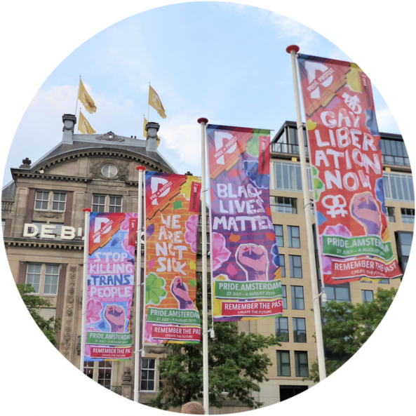

## How do concepts travel?

When Black Lives Matter protests exploded in the summer of 2020, they did so on a global scale. Protests around the world invariably had a dual goal: expressing solidarity with the American BLM movement, and linking that movement's goals to related domestic concerns. I am interested in the international spread of these kinds of political ideas: How are ideas that originate in one context mapped to another situation? How do language barriers affect the diffusion of ideas? And how have social media accelerated and changed the way in which ideas spread?

### The framing of Black Lives Matter outside the U.S.

As Black Lives Matter becomes a global phenomenon, does coverage of BLM outside of the United States resemble coverage of Black Lives Matter in the United States? Answering this question not only helps scholars determine the scope conditions of existing explanations of media coverage of BLM, it also helps activists and citizens understand the how the media shape public perceptions of racial justice movements around the world. Together with my colleague [Erik Bleich](https://www.middlebury.edu/academics/ps/faculty/node/25021) at Middlebury College, I am researching how local conditions affect the reception of the "Black Lives Matter" slogan as well as the associated focus on systemic racism, police brutality, etc. Our goal is to expand this investigation across a number of different countries and current social/political issues (including the #metoo movement and certain ideas about climate change, among others).

### The spread of the idea of systemic racism

When people read or hear about racism in the media, what understanding of racism do they bring to the discussion, and how does the discussion itself conceptualize racism? Has the way the media talk about racism as a problem changed in recent decades? A better understanding of the ordinary usage of the term “racism” is important not just to make sure experts and the public do not talk past one another, but also because how the public understands racism has implications for political preferences and actions, as evidenced in those protests during the summer of 2020. In a current working paper, I find that over the past two decades both the societal and the structural conceptualizations of racism have become more visible in how racism is discussed on television.

### The development of a European public sphere

Over the years, numerous scholars have attempted to gauge the degree to which national discourses about the European Union are connected. However, given problems in comparing discussions about a topic across different languages and media contexts, much of this work has focused on identifying whether the same issues are discussed at the same time, rather than the more important (but also much more difficult) question of whether they are discussed in the same way. In the past few years, new developments in machine learning and machine translation have, for the first time, made it possible to systematically compare the meanings of different texts across languages. Using [high-quality, word-level translation dictionaries](/Software/WMtranslation/) I have developed together with the students in my research lab ([STAIR lab](https://stair.wm.edu)), I assess the development of a European public sphere. The data indicate that such a public sphere has begun to emerge over recent decades, with the greatest changes coming between countries that were previously least connected (separated by both language and geographic distance).
