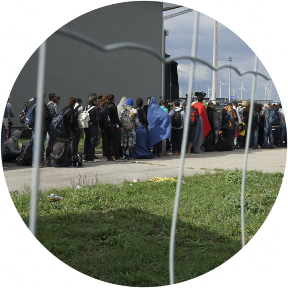

## Migrants and refugees in the public discourse

Migration is a thorny political issue almost everywhere. How are public opinion and policy choices affected by the way people think about migrants? My research looks at whether migrants are thought of differently from refugees or victims of cross-border human trafficking; how the nation of origin of migrants affects attitudes, and how competing perceptions of migrants affect both national policy and international diplomacy (especially within Europe) regarding migrants.

### Differentiating types of international movement

The problem of human trafficking has become increasingly salient in the public and policy discourse. Trafficking is unusual among human rights violations in that it generally involves crossing borders. This makes it particularly important to distinguish trafficking situations from those involving refugees or migrants. However, legal authorities and humanitarian organizations complain that the public (and policy-makers) frequently conflate trafficking with these other types of cross-border movement. I use new techniques from computational linguistics to compare the framing of trafficking, refugees, and migrants in the British and Irish print media. Drawing on a dataset of hundreds of thousands of articles, I show that trafficking is framed far more similarly to cases of (illegal) migration than to cases of other human rights violations.

### Migrants in the Brexit campaign

It is well-established that (the threat of) migration played a prominent role in the Brexit campaign. But which migrants, and how were they discussed. I extract print media references to the European Union since the beginning of European Union membership, and show that migration has only become a major issue for the British in the EU context in recent years, driven by political entrepreneurs such as Nigel Farage's UK Independence Party. In addition, I use collocation analysis to study a large corpus of tweets mentioning Brexit from May/June 2016, and show that tweets using conflict-related keywords disproportionately identify Muslims first, and migrants second. Ironically, topics directly related to Europe and the EU are actually less prominent in tweets about Brexit. I'm currently pursuing this line of inquiry further in order to understand better the role migration played in the campaign, as well as the impact of elites such as Farage.

### The migrant caravan

During the lead-up to the Fall 2018 elections in the United States, President Trump sent more than 5,000 soldiers to the Mexican border. As he claimed in a tweet on Oct. 29, 2018, this was in response to “an invasion of our Country,” by a caravan of migrants that was: 1) largely composed of families with children, who 2) had announced their intention peacefully to request asylum at the border, and 3) at the time, were still well over 1,000 miles away from the border. This transparently manufactured crisis nonetheless resulted in a marked increase of Republican voters who identified immigration as the most important problem facing the United States. A similar caravan in the Spring of 2018, while also receiving attention from President Trump, did not have the same impact, nor have subsequent caravans. In a working paper with students from [STAIR lab](stair.wm.edu), we argue that the difference in impact is due to the successful securitization of the migrant caravan in the Fall of 2018, as evidenced in shifts in Twitter discussions of the caravan. Moreover, we show that the securitization was a short-term, electoral strategy: it was not connected to longer-term policy initiatives or proposals on the part of the Trump administration, and the administration’s emphasis on the security-related aspects of the caravan dropped off noticeably after the election.

