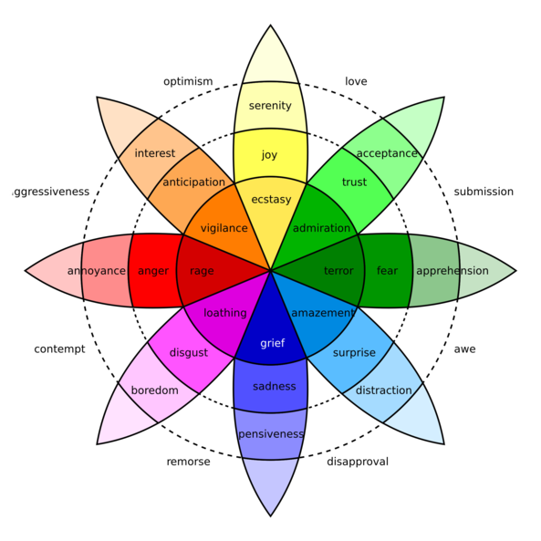

## Software and lexica for automated text analysis

All of the ongoing research projects require an ability to analyze texts: media (both traditional and social), legislative and political debates, party platforms, etc. In particular, I am interested in improving our ability to extract information about the ways an issue is framed from texts, including the emotional and/or moral dimensions of those frames, and across multiple languages. I develop software tools to do so, with a particular focus on the ability to extract the same kinds of information across a number of different languages, in a way that makes it directly comparable.

### MultiLexScaled — sentiment analysis

Sentiment analysis (the measurement of the positivity or negativity of texts) is one of the most widely used tools in computational text analysis. MultiLexScaled is a sentiment analysis tool that can be applied off-the-shelf, has been proven to work well across a range of domains, and obtains performance comparable to dedicated machine learning applications. For more info, see the [entry](/Software/MultiLexScaled/) on my [Software](/Software/) page.

### WMtranslation - word-level translation

Automated machine translation has come a long way, and neural machine translation (as used e.g. by Google Translate) is now very good. However, translating large quantities of texts for research purposes remains very resource intensive. I make available bilingual word-level translation dictionaries that exceed in both size and quality any readily available alternatives. WMtranslation includes these dictionaries, along with python notebooks that can be used to apply them to translate text, as well as notebooks and code that can be used to develop translation dictionaries for additional language pairs. For more info, see the [entry](/Software/WMtranslation/) on my [Software](/Software/) page.