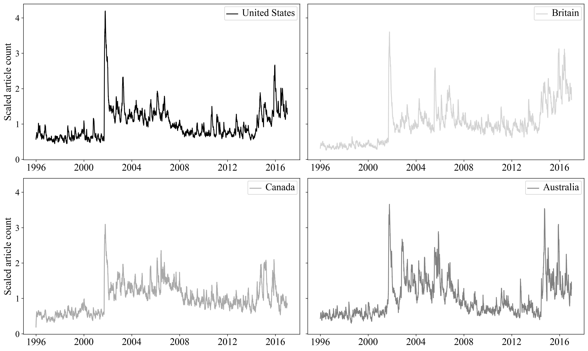

Marshal Zeringue (@zeringuemarshal) maintains a blog in which he asks authors of books to take Ford Madox Ford's "page 99 test" and write about the results. _Covering Muslims_ was featured on December 22. 

Here is page 99 from _Covering Muslims_: 

 
Surprisingly, it is a page wholely dedicated to a figure displaying trends over time in the number of articles published mentioning Muslims in four different countries. 

To read our page 99 test story, click on the image below.
 
 
 
 

